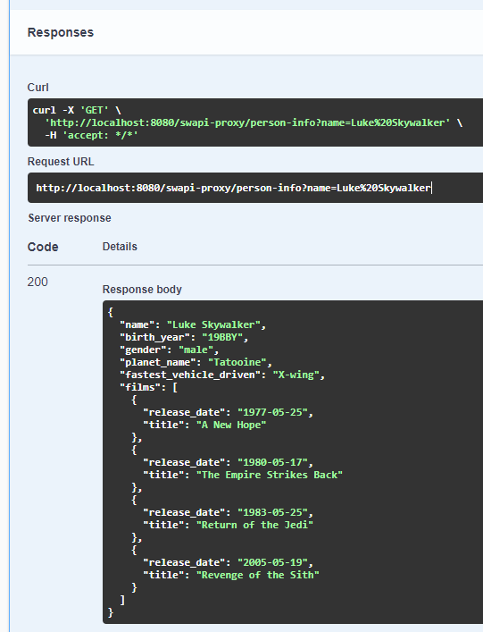
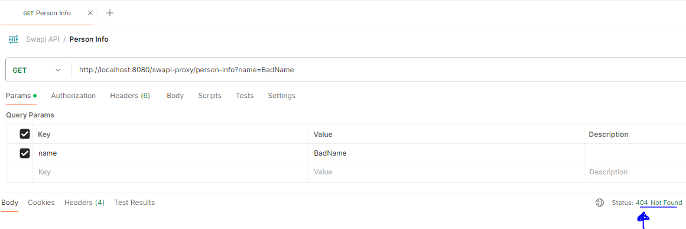
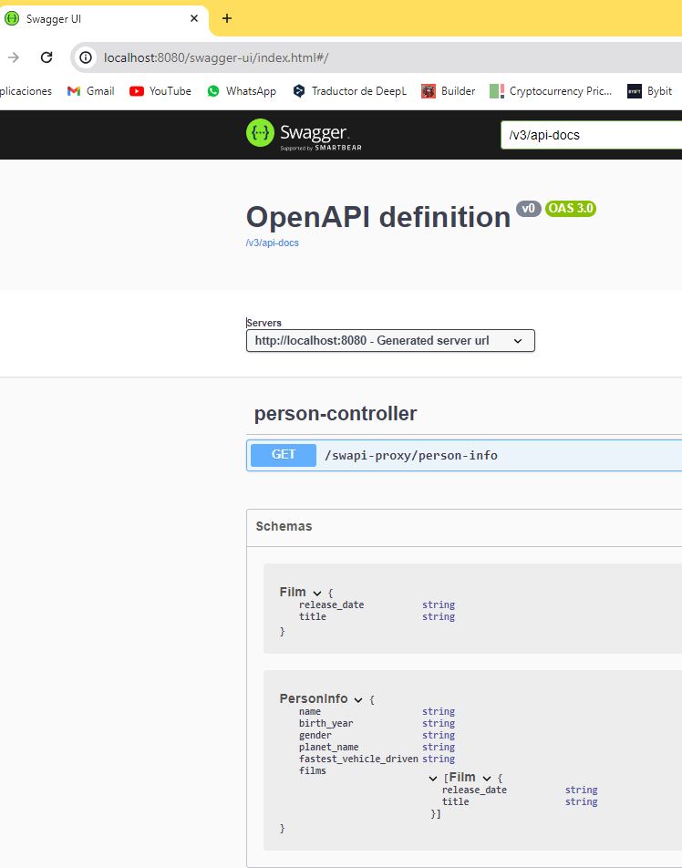
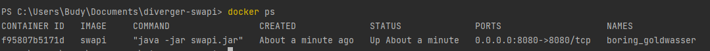
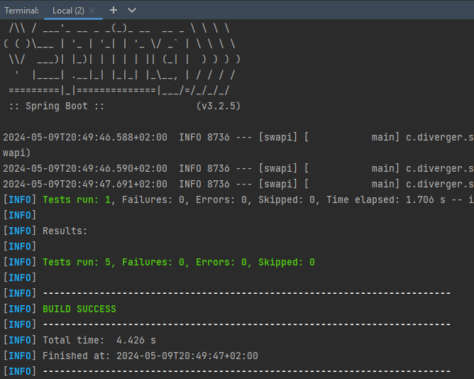

# 🛠️ Technical Test: Swapi

🚀 Diverger Swapi Proxy Java API

### Java Spring dependencies

- Spring web
- Lombok
- Swagger

### Versions

* Spring boot 3.2.5
* Java 17

# Exercise definition

1. Connect to 🔗 https://swapi.trileuco.com/ external API.
2. Create endpoint:
   --> http://{host}:{port}/swapi-proxy/person-info?name=Luke%20Skywalker
3. Return JSON with this format:

```
{
  "name": "Luke Skywalker",
  "birth_year": "19BBY",
  "gender": "male",
  "planet_name": "Tatooine",
  "fastest_vehicle_driven": "X-wing",
  "films": [
    {
      "name": "A New Hope",
      "release_date": "1977-05-25"
    },
    {
      "name": "The Empire Strikes Back",
      "release_date": "1980-05-17"
    },
    {
      "name": "Return of the Jedi",
      "release_date": "1983-05-25"
    },
    {
      "name": "Revenge of the Sith",
      "release_date": "2005-05-19"
    },
    {
      "name": "The Force Awakens",
      "release_date": "2015-12-11"
    }
  ]
}
```

#### Notes:

- **Incorrect name** -- ➡️ return --> **JSON 404 ERROR**
- Attribute **fastest_vehicle_driven** has to be filled with the faster (high max_atmosphering_speed) vehicle or
  starship.

# Implementation

### Folder Structure - DDD

``` 
src/
├── main/
│   ├── java/
│   │   └── com/
│   │       └── diverger/
│   │           └── swapi/
│   │               ├── application/
│   │               │   ├── controller/
│   │               │   │   └── PersonController.java
│   │               │   └── service/
│   │               │       └── PersonService.java
│   │               │
│   │               ├── domain/
│   │               │   ├── exception/
│   │               │   │   └── PersonNotFoundException.java
│   │               │   ├── model/
│   │               │   │   ├── Film.java
│   │               │   │   └── PersonInfo.java
│   │               │   └── repository/
│   │               │       └── SwapiRepository.java
│   │               │
│   │               └── infrastructure/
│   │                   ├── config/
│   │                   │   └── AppConfig.java
│   │                   └── external/
│   │                       └── SwapiRepositoryImpl.java
│   └── resources/
│       └── application.properties
└── test/
    ├── java/
    │   └── com/
    │       └── diverger/
    │           └── swapi/
    │               ├── external/
    │               │   └── SwapiRepositoryImplTest.java
    │               ├── rest/
    │               │   └── controller/
    │               │       └── PersonControllerTest.java
    │               └── service/
    │                   └── PersonServiceTest.java
    └── resources/
        └── application.properties
```

📂 Postman Collection JSON to Import with All Endpoints.

# How to set up

```# Clone the repository from Git
git clone https://github.com/cristianve/diverger-swapi

# Navigate to the project directory
cd diverger-swapi

# Compile the project using Maven
mvn clean install

# Run the project
java -jar target/swapi-0.0.1-SNAPSHOT.jar
```


### Docker steps:

```
docker build -t swapi .

docker run -p 8080:8080 swapi
```

### Swagger URL:

http://localhost:8080/swagger-ui/index.html

# Results

🎉 **Successful 200 OK**:



❌ **404 Not Found**:



🟢 Swagger




📦 Docker:


🔍 Unitary test:

